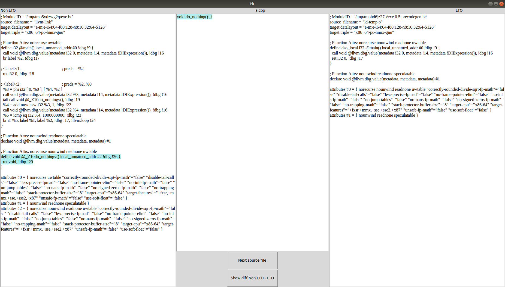

# master

## LTO_Compiler_explorer
Projekat je odradjen po ugledu na compiler explorer(https://godbolt.org/), stim sto ovde prikazujemo
razliku unutar izvrshih fajlova sa ukljucenom otpimizacijom tokom linkovanja i bez nje.
Compiler explorer ne podrzava prikazivanje izvrsnog fajla u llvm medjureprezentaciji, kao sto
ovaj projekat podrzava, ali zbog toga ovaj projekat mora da prodje ceo proces(linkovanje),
sto u slucaju compiler explorera nije potrebno.
Takodje, slicno kao i u compiler explorer-u, oznacene su linije u llvm ir fajlovima koje odgovaraju
linijama u fajlovima izvornog koda. Istom bojom ce biti oznacene odgovarajuce linije u ovim fajlovima.
Klikom na dugme, menja se izvorni fajl i samim tim i obelezene linije unutar llvm ir fajlova.
Trenutno podrzani su iskljucivo programi pisani u programskom jeziku C++.
### Zahtevi
clang-9
wllvm
python3
kompare
python3-tk
llvm

### Primer pokretanja
python3 -i {path_to_dir_with_cpp_files} -o {optimization_level('0', '1', '2', '3', '4', 'z', 'g', 'z', 'fast)}

primer pokretanja "root" direktorijuma ovog projekta

python3 code/main.py  -i code/example/ -o 3

Izvrsenjem komande iznad dobija se ovakav prikaz.

Kao sto vidimo ovde je prikaz fajla main.cpp i odgovarajucih linija u llvm ir fajlovima.
Klikom na dugme, prelazimo na sledeci fajl, to jest fajl a.cpp

Klikom na dugme Show diff dobijamo prikaz razlika izmedju LTO i non LTO llvm ir fajlovima,
u alatu kompare.

